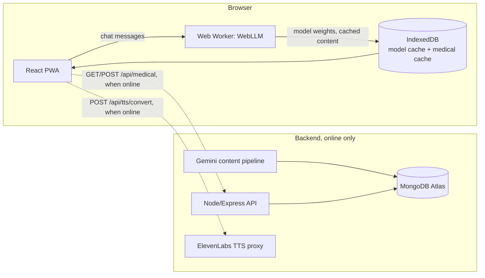

# KIT AI

**KIT AI** is an **offline-first emergency health assistant** for situations where internet access is unreliable or unavailable, like airplanes, hiking trails, or low-connectivity regions.
It provides **objective, widely accepted first-aid information** using a **locally running AI model**, without requiring network access at the time of use.

Live demo: https://kit-ai-smoky.vercel.app

> **Disclaimer:** KIT AI is **not a doctor**, does **not diagnose**, and does **not replace professional medical care**. It shares general first-aid guidance only. In emergencies, seek professional help whenever possible.

---

## Why KIT AI Exists

Most AI health tools require constant internet access. In real emergencies, that's often impossible.

KIT AI is built to:
- Work **fully offline**
- Run directly **on the user's device**
- Share **clear, factual first-aid steps**
- Avoid hallucinations, diagnoses, or personalized medical advice
- Update medical content safely when internet *is* available

---

## What KIT AI Does

- Uses a **local LLM** (WebLLM) running entirely on-device via WebGPU
- Stores vetted first-aid knowledge in **IndexedDB** (syncs from backend when online)
- Provides a chat-style interface for health questions
- Never prescribes medication or gives diagnoses
- Syncs updated medical guidelines *only when online*

---

## What KIT AI Does NOT Do

- No user accounts or logins
- No real-time cloud AI calls during inference
- No diagnosis or treatment plans
- No medication recommendations or dosages
- No replacement for emergency services

---

## Architecture



The frontend is a PWA that runs the model and the medical knowledge cache entirely in the browser. The backend is optional infrastructure for content generation and TTS. It is not required for the core offline chat experience to work.

### Frontend (PWA)
- React + Vite
- Progressive Web App with service worker
- IndexedDB for:
  - LLM model weights (WebLLM cache)
  - Medical knowledge (synced from backend when online)

### Local AI
- `@mlc-ai/web-llm` in a Web Worker
- WebGPU / WASM inference
- Model: `Llama-3.2-1B-Instruct` by default (swapped from 3B for faster load time on Vercel). A larger model can be configured via `VITE_WEBLLM_MODEL_URL`.
- A separate fine-tuned medical model, [Pablo305/llama3-medical-3b-4bit](https://huggingface.co/Pablo305/llama3-medical-3b-4bit), exists but is not yet wired into the PWA (see Known Limitations).

### Backend (Online Only)
- Node.js + Express
- Gemini-based pipeline that generates first-aid guideline content
- MongoDB Atlas stores that content
- `GET /api/medical` — frontend fetches and caches when online
- `POST /api/medical` — ingest script updates content, gated behind `MEDICAL_API_KEY`
- ElevenLabs TTS proxy (`POST /api/tts/convert`) for higher-quality voice, with the browser's built-in speech synthesis as a fallback

---

## Tech Stack

| Layer | Technologies |
|-------|--------------|
| Frontend | React, Vite, Tailwind CSS, PWA |
| Local AI | @mlc-ai/web-llm, WebGPU |
| Backend | Node.js, Express, MongoDB, Gemini API |
| Voice | ElevenLabs (online), browser SpeechSynthesis (offline fallback) |
| Storage | IndexedDB (frontend), MongoDB Atlas (backend) |

---

## Getting Started

### Prerequisites
- Node.js 18+
- MongoDB Atlas account (or local MongoDB), only needed if you're running the backend
- Browser with WebGPU (Chrome 113+, Edge 113+, Safari 26+, Firefox 141+)

### Backend

```bash
cd backend
cp .env.example .env
# Edit .env with your MONGODB_URI, PORT, FRONTEND_ORIGIN, MEDICAL_API_KEY
npm install
npm run dev
```

Ingest initial medical content (with backend running):

```bash
npm run ingest
# Or: npm run ingest path/to/medical-knowledge.json
```

### Frontend

```bash
cd frontend
cp .env.example .env
# For API mode: set VITE_MEDICAL_SOURCE=api and VITE_MEDICAL_API_URL
npm install
npm run dev
```

Visit `http://localhost:5173`. On first load (while online), the model downloads and medical content syncs. After that, the app works offline.

---

## Configuration

### Frontend (`.env`)
| Variable | Description |
|----------|-------------|
| `VITE_MEDICAL_SOURCE` | `api` or `static` |
| `VITE_MEDICAL_API_URL` | Backend URL, e.g. `http://localhost:3001/api/medical` |
| `VITE_WEBLLM_MODEL_URL` | Optional. Points at a larger or custom model instead of the default 1B model |

### Backend (`.env`)
| Variable | Description |
|----------|-------------|
| `MONGODB_URI` | MongoDB Atlas connection string |
| `PORT` | Server port (default 3001) |
| `FRONTEND_ORIGIN` | CORS origin (default `http://localhost:5173`) |
| `MEDICAL_API_KEY` | Required to call `POST /api/medical`. If unset, that endpoint is disabled rather than open. |

---

## Medical Content Format

```json
{
  "version": 1,
  "entries": [
    { "id": "topic-id", "content": "Medical content..." }
  ]
}
```

Use `npm run ingest` in the backend to push this format to MongoDB.

---

## Known Limitations

- **WebGPU is a hard requirement, with no fallback yet.** If the browser or device doesn't support WebGPU, the app currently shows an error instead of degrading to a slower CPU path or a hosted model.
- **The backend and TTS pipeline aren't connected in the live deploy.** The Vercel demo runs frontend-only, against the static bundled medical content, with browser speech synthesis for voice. The Express/MongoDB/Gemini/ElevenLabs backend exists and works locally, but isn't deployed alongside it.
- **The fine-tuned medical model isn't integrated into the PWA yet.** [Pablo305/llama3-medical-3b-4bit](https://huggingface.co/Pablo305/llama3-medical-3b-4bit) is trained and published, but the app still ships with the general-purpose Llama-3.2-1B-Instruct model.

---

## Example Use Cases

- In-flight medical situations
- Hiking or camping emergencies
- Regions with limited internet access
- Disaster or outage scenarios

---

## Ethics & Safety

KIT AI is intentionally **conservative**:
- When uncertain, it escalates to "seek professional help"
- It avoids personalized or speculative advice
- It prioritizes clarity, calmness, and safety

---

## Team

KIT AI was built by a 5-person team at a hackathon. My (Pablo's) parts:
- The IndexedDB retrieval and medical-cache layer that lets the app work fully offline after first load
- The online/offline TTS fallback (ElevenLabs when the backend is reachable, browser speech synthesis when it isn't)
- Vercel deploy fixes to get the PWA actually loading in production
- A fine-tuned medical model, [Pablo305/llama3-medical-3b-4bit](https://huggingface.co/Pablo305/llama3-medical-3b-4bit), fine-tuned during the hackathon and not yet wired into the app

---

## Project Status

Active development. Current features:
- WebLLM-based offline chat
- Medical knowledge cache with backend sync
- PWA with IndexedDB caching
